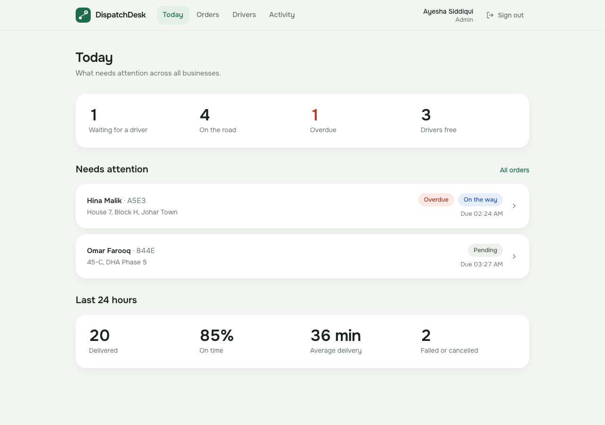
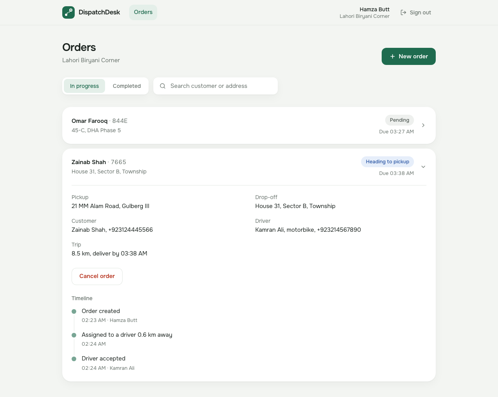
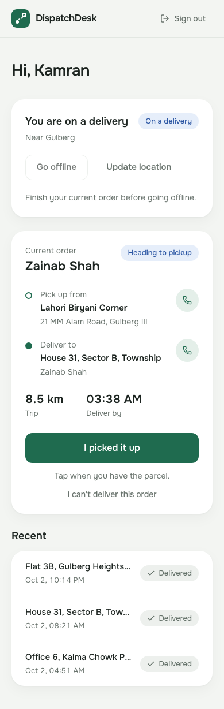
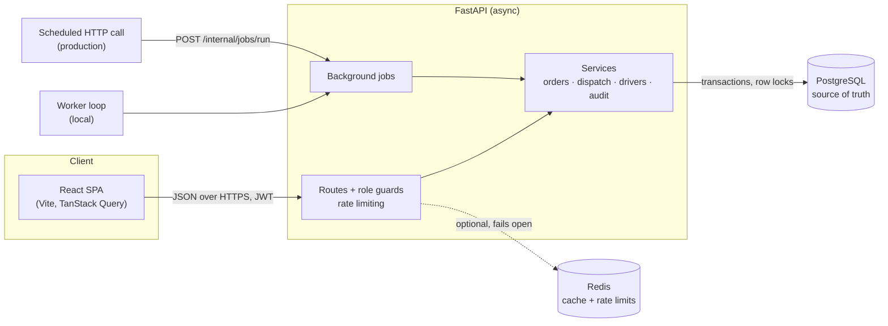
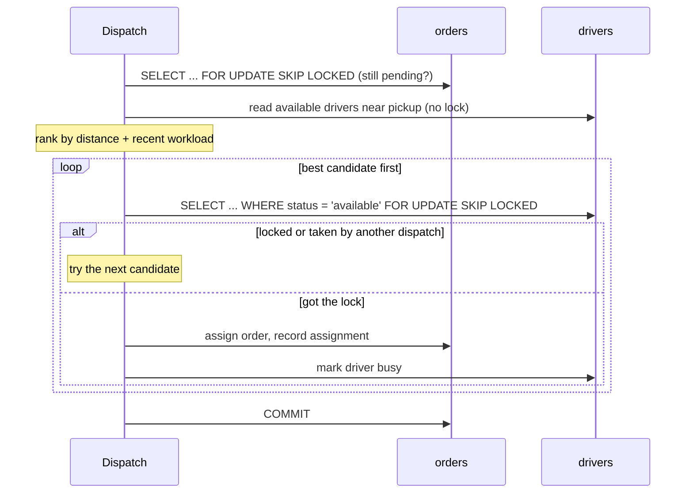
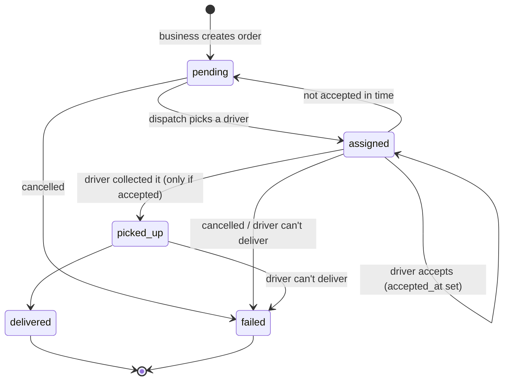
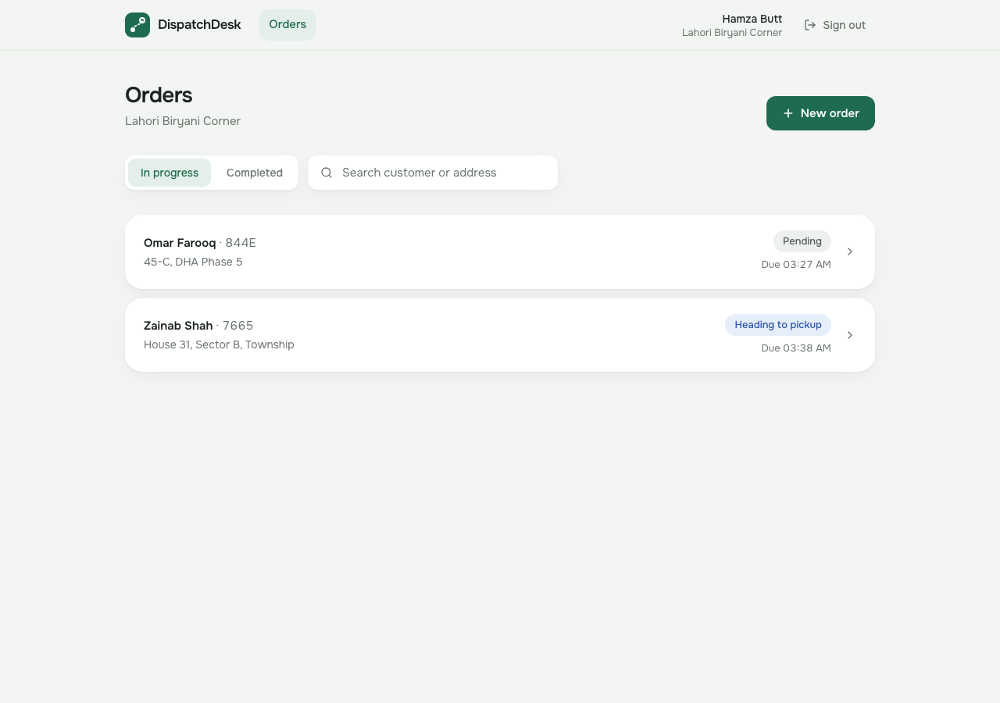

# DispatchDesk

[](https://github.com/abdulmanaan/dispatchdesk/actions/workflows/ci.yml)

A local delivery dispatch and driver management system. Restaurants, pharmacies and shops create
delivery orders; DispatchDesk assigns each one to the best available driver nearby, and a driver
can never end up with two orders at once, even when many orders are dispatched at the same moment.



| Business: orders and timeline | Driver: phone view |
| --- | --- |
|  |  |

## What it does

| Role | Can |
| --- | --- |
| **Business** | Create delivery orders (pickup defaults to the shop, drop-off by area or coordinates), follow each order's status and timeline, cancel before pickup |
| **Driver** | Go online or offline, share location, accept the offered order, mark it picked up and delivered, or report why it can't be delivered |
| **Admin** | See what needs attention, browse every order and driver, dispatch manually, cancel, and read the full audit trail |

Orders move through `pending → assigned → picked_up → delivered` (or `failed`). An assigned order
must be **accepted** by the driver; if it isn't accepted in time, it goes to someone else.

## Architecture



- **Thin routes, logic in services.** Routes handle HTTP and permissions; services own the rules
  and raise domain errors (`NotFoundError`, `ConflictError`, ...) that one handler maps to status codes.
- **PostgreSQL is the source of truth** for every rule that matters. Redis only speeds things up
  and limits abuse; if it is down, requests still succeed.
- **One state machine** (`app/services/order_state.py`) defines every allowed status change. API
  actions, dispatch, background jobs and the demo simulator all go through it.

## Conflict-free dispatch

The core problem: two orders created at the same moment must not be handed to the same driver.
Each dispatch runs in a single transaction:



- **Only the chosen driver is locked.** An earlier version locked every nearby candidate; that was
  safe, but 10 parallel orders with 3 free drivers assigned only one. Locking one driver at a time
  lets parallel dispatches use different drivers.
- **`SKIP LOCKED` instead of waiting.** A busy row means someone else is handling it, so dispatch
  moves on instead of queueing behind the lock.
- **The database backstop.** A partial unique index allows at most one active order per driver:
  `UNIQUE (driver_id) WHERE status IN ('assigned', 'picked_up')`. Even a bug in the locking code
  could not create a double booking; it would fail on commit.
- **Lock order rule.** Whenever both are needed, the order row is locked before the driver row,
  everywhere in the code, so these transactions cannot deadlock.

**Scoring.** Candidates must be available, within 15 km of the pickup, have a recent location,
and not have let this order expire before. Distance is the haversine (great-circle) formula in
plain Python, with a SQL bounding box as a cheap pre-filter. The score is
`distance_km + 1.0 × deliveries completed in the last 8 hours`, so work spreads fairly between
drivers at similar distances. All thresholds are settings.

**Tested against real Postgres.** The concurrency tests fire parallel dispatches and also hold
locks in a second transaction to prove blocking and skipping behaviour. Each lock was checked by
deliberately removing it and confirming that a test fails.

## Order lifecycle



Check constraints in the database enforce the same shape: a pending order has no driver, an
assigned or picked-up order always has one, and nothing is picked up without `accepted_at`.

## Background jobs

| Job | What it does |
| --- | --- |
| Expire unaccepted assignments | An order not accepted within 3 minutes goes back to `pending` and is re-dispatched to someone else; the unresponsive driver is set offline |
| Retry pending orders | Dispatches orders created while no driver was free, most urgent deadline first |
| Flag overdue orders | Marks open orders past their deadline (once), with an audit entry |

All jobs are safe to run twice at the same time: each order is locked with `SKIP LOCKED` and its
state re-checked under the lock, and bulk flagging is a single atomic `UPDATE`. A global
"single runner" advisory lock is deliberately not used, because session-level advisory locks
break behind a transaction-mode connection pooler such as Neon's.

Locally a worker container runs the jobs every 30 seconds. Free hosting tiers don't run
long-lived workers, so production triggers the same code through a token-protected
`POST /internal/jobs/run` called on a schedule.

## More design decisions

- **Audit trail in the same transaction.** Every state change writes an `audit_logs` row in the
  same transaction as the change, so the history can never disagree with the data. It powers the
  admin activity log and each order's timeline.
- **Roles are read from the database on every request,** not trusted from the JWT, so disabling
  a user or changing a role takes effect immediately.
- **Rate limiting** with fixed one-minute windows in Redis: 10 login or registration attempts per
  IP, 120 requests per user otherwise. `X-Forwarded-For` is ignored unless explicitly trusted, so
  clients can't dodge limits by faking IPs.
- **Caching only where it pays off.** The dashboard stats are cached for 10 seconds. Order and
  driver lists stay live: their data changes every few seconds, so invalidating on every write
  would make the cache almost always empty.
- **No maps API.** Distances are computed in Python, and businesses pick the drop-off from a list
  of Lahore areas or enter coordinates.

## Demo mode

`python -m app.scripts.seed_demo` creates four fictional businesses, nine drivers and a day of
order history around Lahore, with consistent assignments and timelines. With `DEMO_MODE=true`:

- the login page offers **one-click sign-in** as the demo admin, business and driver (no passwords
  are shipped to the frontend);
- the seeded **background drivers are simulated**: they accept, pick up and deliver on a timer
  through the same services as real drivers, so a visitor's order actually gets delivered. The
  demo driver account that visitors use is never automated.



## Tech stack

| Layer | Tech |
| --- | --- |
| Backend | Python 3.12, FastAPI, SQLAlchemy 2 (async) + asyncpg, Alembic, Pydantic, uv |
| Data | PostgreSQL 17, Redis 7 |
| Auth | JWT (PyJWT), Argon2 password hashing (pwdlib) |
| Frontend | React 19, TypeScript, Vite, Tailwind CSS 4, React Router, TanStack Query |
| Testing | pytest + pytest-asyncio against real Postgres and Redis, Vitest + Testing Library |
| Tooling | Docker Compose, Ruff, oxlint, Prettier, GitHub Actions |

## Project structure

```
backend/
  app/
    api/routes/      HTTP endpoints (auth, orders, drivers, dispatch, stats, audit, internal)
    services/        business logic: orders, order_state, dispatch, drivers, geo, audit, stats
    models/          SQLAlchemy models and enums
    schemas/         request and response models
    jobs/            background jobs and the worker loop
    demo/            demo seed data and simulated drivers
    core/            settings, security, errors, Redis, cache, rate limiting
  alembic/           migrations
  tests/             pytest suite
frontend/
  src/
    pages/           admin, business and driver screens, login
    components/      shared UI (order card, timeline, pills, controls)
    lib/             API client, hooks, formatting, status labels
    auth/            session provider and route guards
docs/screenshots/    images used in this README
```

## API overview

Interactive docs at `/docs` when the backend is running. Main endpoints:

| Endpoint | Who |
| --- | --- |
| `POST /auth/register/business`, `/auth/register/driver`, `/auth/login`, `GET /auth/me` | everyone |
| `GET /orders` (filters, search, sorting, pagination), `GET /orders/{id}`, `GET /orders/{id}/events` | scoped by role |
| `POST /orders`, `POST /orders/{id}/cancel` | business (cancel also admin) |
| `POST /orders/{id}/accept`, `/pickup`, `/deliver`, `/fail` | the assigned driver |
| `PUT /drivers/me/status`, `PUT /drivers/me/location`, `GET /drivers/me/order` | driver |
| `GET /drivers`, `GET /stats/overview`, `GET /audit-logs`, `POST /dispatch/orders/{id}`, `POST /dispatch/run` | admin |

## Running locally

Requires Docker.

```bash
cp .env.example .env
cp backend/.env.example backend/.env
docker compose up -d
docker compose exec backend python -m app.scripts.seed_demo
```

| Service | URL | Notes |
| --- | --- | --- |
| Frontend | http://localhost:5173 | Vite dev server; `/api` is proxied to the backend |
| Backend | http://localhost:8000/docs | Interactive API docs |
| Postgres | `localhost:5433` | Also creates `dispatchdesk_test` for tests |
| Redis | `localhost:6379` | Cache and rate limits |

Open the frontend and use the one-click demo buttons. `seed_demo --reset` wipes all data and
reseeds. To create a real admin: `docker compose exec backend python -m app.scripts.create_admin --email you@example.com`.

## Tests

```bash
cd backend && uv run pytest        # 217 tests, needs the Postgres and Redis containers
cd frontend && npm test            # 47 tests
```

CI runs both suites on every push and pull request, with lint, formatting and type checks, against
real Postgres and Redis service containers. The backend tests rebuild the schema from the Alembic
migrations on every run and fail if a model changes without a migration.

See [backend/README.md](backend/README.md) for backend details and settings.
